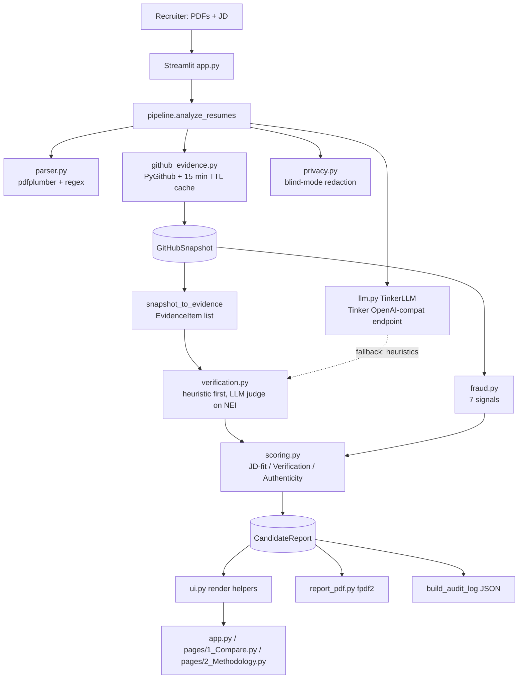

# Grifter Filter — Architecture

**Version 0.2 · July 2026**

## 1. System overview

**Data flow:** PDF bytes → `CandidateProfile` → `GitHubSnapshot` → (`EvidenceItem[]`, `FraudSignal[]`) → claims → `ClaimVerdict[]` → `CandidateScores` → `CandidateReport` → UI / CSV / JSON / PDF / audit log.

## 2. Module responsibilities

| Module | Public surface | Responsibility |
|---|---|---|
| `resumesort/schemas.py` | dataclasses | All shared types; `Verdict` literal; `AnalysisSettings` |
| `resumesort/parser.py` | `parse_resume_pdf`, `extract_*` | pdfplumber text + regex field extraction (incl. claimed years of experience) |
| `resumesort/github_evidence.py` | `fetch_github_snapshot`, `snapshot_to_evidence`, `fetch_github_evidence` (compat), `clear_snapshot_cache` | One place that talks to the GitHub API; builds the snapshot both evidence and fraud consume; module-level TTL cache |
| `resumesort/fraud.py` | `analyze_fraud_signals` | Pure functions over the snapshot; one private function per signal |
| `resumesort/llm.py` | `TinkerLLM` (`extract_claims`, `judge_claim`, `summarize`, `generate_interview_questions`), `parse_json_object`, `strip_reasoning` | All Tinker calls, JSON salvage, circuit breaker, deterministic fallbacks |
| `resumesort/verification.py` | `verify_claims`, `top_evidence_matches` | Heuristic-first verdicts; LLM judge only for NEI cases, capped at 6/candidate |
| `resumesort/scoring.py` | `score_jd_fit`, `score_verification`, `score_authenticity`, `combine_scores`, `cosine_text_similarity` | All formulas (published verbatim on the Methodology page) |
| `resumesort/privacy.py` | `redact_text_for_llm`, `blind_display_name` | Blind-screening redaction |
| `resumesort/pipeline.py` | `analyze_resumes`, `reports_to_dataframe/json`, `build_audit_log` | Orchestration, progress callbacks, exports |
| `resumesort/report_pdf.py` | `build_candidate_pdf` | fpdf2 PDF (latin-1 v1; DejaVu TTF is the upgrade path) |
| `resumesort/ui.py` | render helpers, session-state accessors | Shared across the three Streamlit pages |
| `app.py`, `pages/` | — | Streamlit multipage UI |

## 3. Tinker integration (ground truth, verified 2026-07-05)

**Endpoint:** the documented OpenAI-compatible endpoint
`https://tinker.thinkingmachines.dev/services/tinker-prod/oai/api/v1` (override: `TINKER_BASE_URL`), authenticated with `TINKER_API_KEY`, called through the `openai` SDK. Empirically it accepts **base-model names** (e.g. `openai/gpt-oss-20b`) as well as the documented `tinker://` checkpoint paths.

**Why this path over the native `tinker` SDK:** the server renders the model's chat template and (June 2026+, `separate_reasoning` defaults true) splits chain-of-thought into `reasoning_content`, so `content` arrives clean — no client-side tokenizer, no `transformers` dependency, no HF Hub downloads on Space cold start. The native SDK path is kept in `scripts/tinker_smoke.py --native` for reference.

**Model:** default `openai/gpt-oss-20b` (Reasoning, $0.12/M prefill, $0.30/M sample — cheapest in the July 2026 catalog). The system prompt pins `Reasoning: low` (harmony convention) for latency; note `reasoning_effort` as an API param 400s on gpt-oss models, so it is deliberately not sent. Model ID is configurable per run (sidebar) and via `TINKER_BASE_MODEL` because **Tinker retires models roughly six-monthly** (June 12, 2026 wave removed most small Qwen/Llama models). Current catalog: `https://tinker-docs.thinkingmachines.ai/tinker/models.json`.

**The four call types** (all JSON-contract prompts parsed by `parse_json_object`, which also strips `<think>` blocks defensively):

| Call | Purpose | Guardrails |
|---|---|---|
| `extract_claims` | Resume → atomic checkable claims | Falls back to parsed projects/experience lines |
| `judge_claim` | Claim + top-4 evidence → verdict | Evidence-only judging; **REFUTED requires contradicting evidence — absence is NEI**; model returns `evidence_index`, resolved to a URL locally (no hallucinated links) |
| `summarize` | Report → 2-paragraph summary | Receives verdicts; may only assert SUPPORTED items as fact |
| `generate_interview_questions` | Gaps + signals → fair questions | Deterministic fallback templates |

**Circuit breaker:** first exception disables the client for the run, surfaces the error in the UI banner, and every downstream call uses deterministic fallbacks. `api_calls`/`api_successes` counters are shown in the UI.

**Cost:** ~9 calls/candidate ≈ 15K prefill + 3K sampled tokens ≈ **$0.003/candidate**.

## 4. Failure / fallback matrix

| Condition | Behavior |
|---|---|
| No `TINKER_API_KEY` | Heuristic verdicts (token-cosine thresholds 0.22/0.10), template summary/questions; UI shows "heuristic fallback" |
| Tinker error mid-run | Circuit breaker; remaining candidates processed heuristically; error banner |
| No `GITHUB_TOKEN` | Shallow mode: max 5 repos, no contributors/stats/root-files calls, flag "deep fraud checks skipped" |
| No GitHub URL on resume | `Missing GitHub link` flag; authenticity −0.35; all claims NEI |
| `stats/commit_activity` returns 202/None (cold cache) | Clustering signal falls back to sampled commit dates (warn instead of high) |
| Non-latin characters in PDF export | latin-1 `replace` sanitizer (documented limitation) |

## 5. GitHub rate-limit budget

Authenticated: 5,000 req/hr. Deep mode ≈ 6 calls/repo (repo list amortized): at `max_repos=10`, ~62 calls/candidate → a 5-resume run ≈ 310 calls. The 15-minute snapshot cache makes weight-tweaking re-runs free. Anonymous: 60 req/hr → shallow mode caps at 5 repos (~20 calls/candidate) and skips deep endpoints.

## 6. Deployment topology

**Host:** Hugging Face Spaces, free CPU basic (2 vCPU / 16 GB), SDK `streamlit`, `app_file: app.py`. The README's YAML front-matter configures the Space; a single repo pushes to both GitHub (`origin`) and the Space (`hf` remote).

**Secrets:** Space Settings → `TINKER_API_KEY`, `GITHUB_TOKEN` (fine-grained PAT, public-repo read-only). They arrive as environment variables; the code reads only `os.getenv` (identical local/deployed; `.env` + python-dotenv locally).

**Dependencies (deliberately slim):** streamlit, pdfplumber, PyGithub, pandas, python-dotenv, openai, fpdf2 — no torch/transformers (~2.5 GB saved), builds in ~2 min, cold-starts fast. Free Spaces sleep after ~48 h idle; first visitor waits ~30–60 s.

**State:** session-only (`st.session_state`). No resume is persisted server-side — by design (privacy posture and free-tier disk).

## 7. Security notes

- No hardcoded secrets; `.env` is gitignored; the one historical key leak was in an untracked file, which was deleted and the key rotated.
- Resume PII goes only to: (a) the Tinker inference API, and (b) nowhere else. Blind mode redacts identity fields before (a).
- Audit logs contain PII (names, verdicts) — they are user-downloaded artifacts, never stored server-side.
- GitHub token needs only `public_repo` read scope.

## 8. Testing strategy

- **Unit:** parsing regexes, scoring formulas/bounds, JSON salvage + `<think>` stripping, verdict index resolution, per-signal fraud fixtures, redaction, PDF magic bytes + unicode, audit-log schema. (`pytest -q`, 29 tests.)
- **Mocked integration:** full pipeline with `parse_resume_pdf`/`fetch_github_snapshot` monkeypatched, no network.
- **Live smoke:** `scripts/tinker_smoke.py` — lists the current model catalog and asserts a JSON round-trip through the real endpoint. Gate for any LLM-touching change.
- **E2E (manual, performed):** synthetic resume with planted fake claims vs a real GitHub profile → fake "Rust trading engine" REFUTED, "Rust zero bytes" + "account age gap" signals fired, 9/9 Tinker calls succeeded, PDF and audit log generated.
